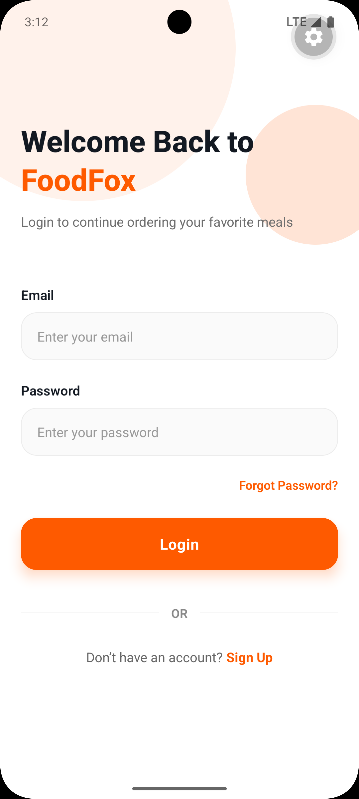
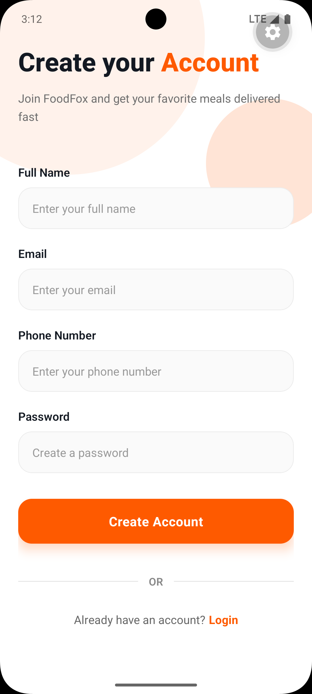
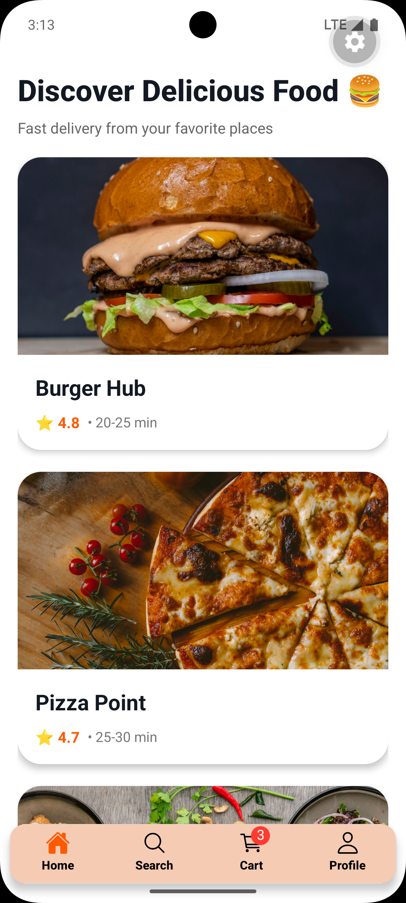
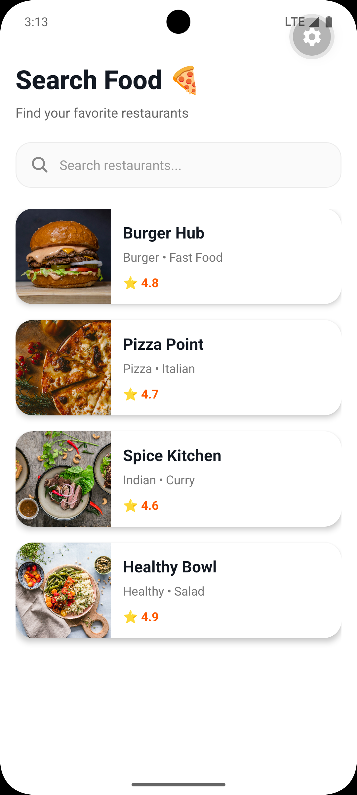
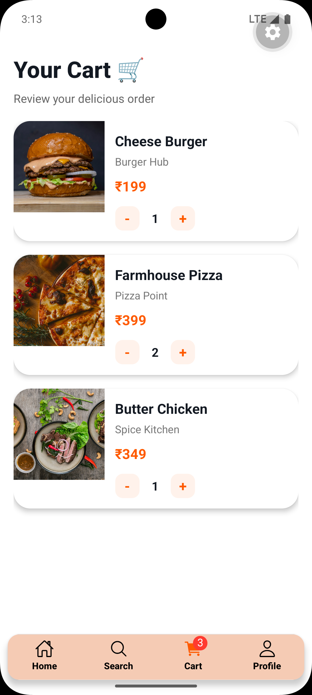
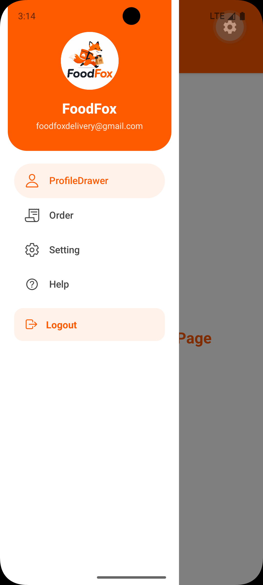

# Navigation Overview — FoodFox

This document describes the types of navigation used in this project and points to the navigator implementations and example screenshots.

## Summary

The app uses React Navigation with a combination of navigators to structure the app flow:
Video Link : [Link](https://drive.google.com/file/d/1Hj7Z4X9G_KQf30UUqwYs5OlVQ1KHPtCD/view?usp=sharing)

- Stack Navigator — for screen-to-screen flows and nested stacks.
- Tab Navigator — for primary bottom tab navigation between main sections.
- Drawer Navigator — for profile/settings and side navigation.
- Combined navigators — stacks nested inside tabs and/or drawers.

## Navigator files

- Home Stack: [src/navigators/HomeStackNavigator.jsx](src/navigators/HomeStackNavigator.jsx)
- Main Stack: [src/navigators/MainStackNavigator.jsx](src/navigators/MainStackNavigator.jsx)
- Main Tab Navigator: [src/navigators/MainTabNavigator.jsx](src/navigators/MainTabNavigator.jsx)
- Profile Drawer Navigator: [src/navigators/ProfileDrawerNavigator.jsx](src/navigators/ProfileDrawerNavigator.jsx)

Inspect those files to see how screens are registered and how navigators are nested.

## How they are used

- The `MainTabNavigator` defines the bottom tabs (Home, Search, Orders, Profile).
- The `HomeStackNavigator` contains the Home-related screens (Home, Restaurant Details, Order, etc.) and is typically nested in the tabs so deep navigation stays within the tab.
- The `ProfileDrawerNavigator` provides a side drawer for profile and settings access; it can wrap the main app or be nested on the Profile tab.
- `MainStackNavigator` coordinates auth flows and the main app stack (login/signup → main tabs).

## Screenshots

Below are the screenshots captured in the project (embedded from the `ScreenShots/` folder):

*Home / Main tab view*

*Search / Results view*

*Restaurant details*

*Cart / Order preview*

*Profile / Drawer preview*

*Settings or other screen*

*Misc UI*

*Misc UI 2*

(The video `FoofFox preview.webm` is in the `ScreenShots/` folder if you want a short recording.)

## Quick pointers

- To modify the tab layout, edit [src/navigators/MainTabNavigator.jsx](src/navigators/MainTabNavigator.jsx).
- To change stack routes for Home, edit [src/navigators/HomeStackNavigator.jsx](src/navigators/HomeStackNavigator.jsx).
- To update drawer items, edit [src/navigators/ProfileDrawerNavigator.jsx](src/navigators/ProfileDrawerNavigator.jsx).

If you'd like, I can:
- Add inline code snippets showing how each navigator is created.
- Extract a small diagram of the navigator hierarchy.
- Commit this README to git and open a PR.

