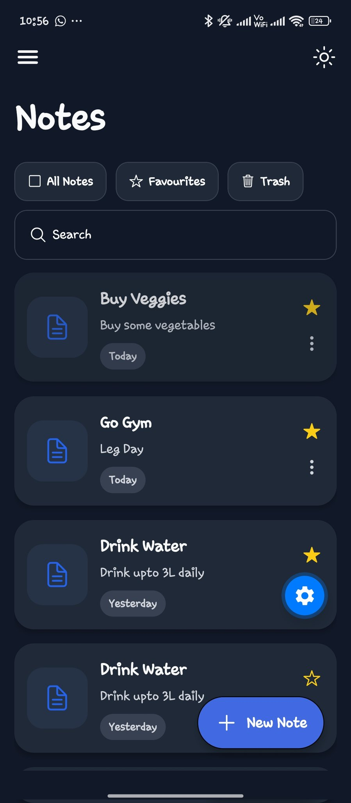
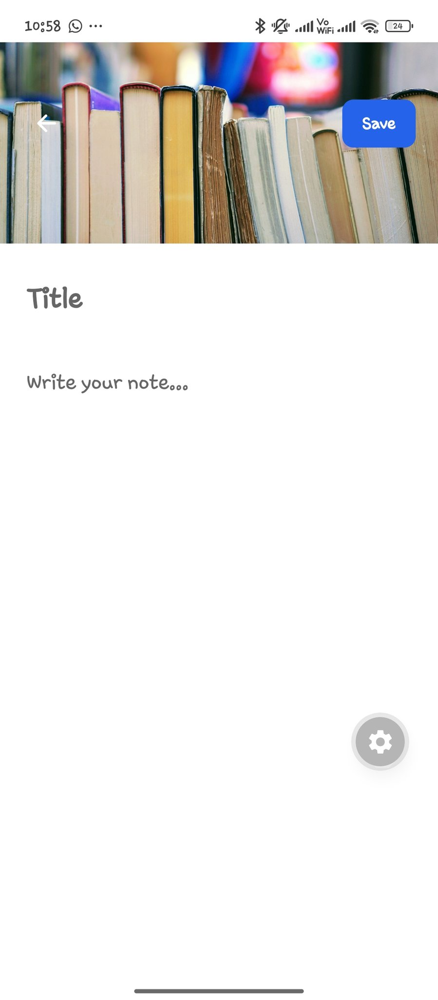
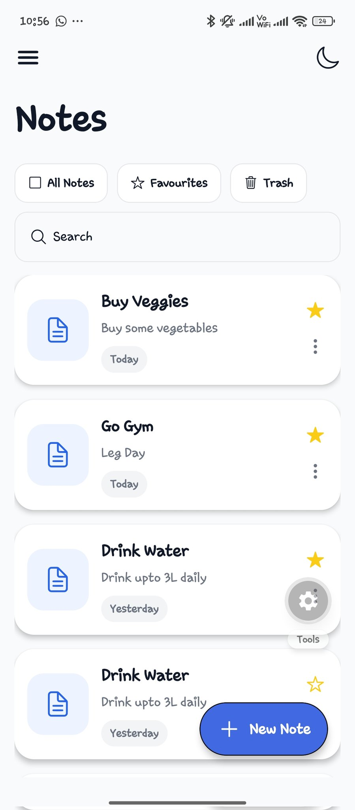

# React Native Notes App - Learning Guide

## 📚 Project Overview

This is a React Native + Expo project for a Notes application built with TypeScript. The app demonstrates core React Native concepts including state management, styling, theme switching, and navigation with Expo Router.

---

## 🎣 React Hooks Used

### 1. **useState Hook**
The primary state management hook used throughout the application.

**Used in:**
- **NotesEditing.tsx**: Managing note title and content
  ```javascript
  const [title, setTitle] = useState("");
  const [note, setNote] = useState("");
  ```

- **NotesListing.tsx**: Managing search input and dark mode toggle
  ```javascript
  const [search, setSearch] = useState("");
  const [darkMode, setDarkMode] = useState(false);
  ```

### 2. **useWindowDimensions Hook**
Used for responsive design and accessing window dimensions.

**Used in:**
- **NotesListing.tsx**: Getting device screen width and height
  ```javascript
  const { width, height } = useWindowDimensions();
  ```
  Allows the UI to adapt to different screen sizes dynamically.

### 3. **useColorScheme Hook**
Used to detect system-level theme preference (light/dark mode).

**Used in:**
- **NotesListing.tsx**: Currently commented out but available for system-level theme detection
  ```javascript
  // const systemTheme = useColorScheme();
  // const theme = systemTheme === "dark" ? darkTheme : lightTheme;
  ```

---

## 🧩 React Native Components Used

### **Core Layout Components**

| Component | Purpose | Used In |
|-----------|---------|---------|
| **View** | Container/wrapper component | All pages |
| **SafeAreaView** | Ensures content is visible on all devices (notches, etc.) | NotesEditing, NotesListing |
| **KeyboardAvoidingView** | Prevents content from being hidden by keyboard | NotesEditing |
| **Text** | Display text content | All pages |

### **Input Components**

| Component | Purpose | Used In |
|-----------|---------|---------|
| **TextInput** | User text input field | NotesEditing, NotesListing |

### **Interactive Components**

| Component | Purpose | Used In |
|-----------|---------|---------|
| **Pressable** | Detects press interactions | NotesListing (menu, theme toggle, note items) |
| **TouchableOpacity** | Pressable with opacity feedback | FloatingButton |

### **Display Components**

| Component | Purpose | Used In |
|-----------|---------|---------|
| **ImageBackground** | Background image container | NotesEditing (header with image) |
| **FlatList** | Render scrollable list efficiently | NotesListing |
| **StatusBar** | Control status bar styling | NotesListing |

### **Styling Component**

| Component | Purpose | Usage |
|-----------|---------|-------|
| **StyleSheet** | Creates optimized style objects | All pages |

---

## 🎨 Icon Library

### **Ionicons from @expo/vector-icons**
Used throughout the app for UI icons.

**Examples:**
- `arrow-back` - Back button
- `menu` - Menu icon
- `moon-outline` / `sunny-outline` - Theme toggle icons
- `add` - Add note button

**Imported in:**
- NotesEditing.tsx
- NotesListing.tsx
- FloatingButton.tsx

---

## 📱 Custom Components

### **1. FloatingButton Component**
**File:** `src/app/components/FloatingButton.tsx`

**Purpose:** A floating action button for creating new notes

**Features:**
- Positioned absolutely at bottom-right
- Icon and text ("New Note")
- Blue background (#4169E1)
- Elevation/shadow for depth
- Uses TouchableOpacity for press feedback

**Props:** None (currently static)

**Used in:** NotesListing.tsx

---

## 🎭 Theme System

### **Theme Objects**
Two theme configurations are defined to support light and dark modes.

**LightTheme** (`src/app/themes/LightTheme.js`):
```javascript
{
  background: "#F9FAFB",    // Light gray background
  card: "#FFFFFF",           // White cards
  text: "#111827",          // Dark text
  subText: "#6B7280",       // Gray subtext
  border: "#E5E7EB",        // Light border
  badge: "#F3F4F6",         // Light badge
  iconBackground: "#EEF4FF" // Light blue icons
}
```

**DarkTheme** (`src/app/themes/DarkTheme.js`):
```javascript
{
  background: "#111827",    // Dark gray background
  card: "#1F2937",          // Darker cards
  text: "#F9FAFB",          // Light text
  subText: "#D1D5DB",       // Light gray subtext
  border: "#374151",        // Dark border
  badge: "#374151",         // Dark badge
  iconBackground: "#263245" // Dark blue icons
}
```

### **Theme Usage Pattern**
In NotesListing.tsx:
```javascript
const [darkMode, setDarkMode] = useState(false);
const theme = darkMode ? darkTheme : lightTheme;

// Apply theme to styles
<SafeAreaView style={[
  styles.container,
  { backgroundColor: theme.background }
]}>
```

---

## 📄 Page Structure

### **NotesEditing.tsx** - Note Editor Screen
- **State:** Title and note content
- **Components:** TextInput (for title and note), ImageBackground header
- **Features:** Keyboard handling with KeyboardAvoidingView, save button

### **NotesListing.tsx** - Main Notes List
- **State:** Search query, dark mode toggle
- **Components:** FlatList (renders notes), SearchInput, FloatingButton
- **Features:** Search filtering, theme switching, responsive design

---

## 🛠️ Dependencies & Libraries

### **Core Framework**
- `react` (19.2.0) - React library
- `react-native` (0.83.6) - Native mobile framework
- `expo` (~55.0.23) - Expo CLI and services

### **Navigation & Routing**
- `expo-router` (~55.0.14) - File-based routing (used in _layout.tsx)
- `@react-navigation/native` - Navigation framework
- `@react-navigation/bottom-tabs` - Bottom tab navigation
- `@react-navigation/elements` - Navigation components

### **UI & Styling**
- `@expo/vector-icons` (^15.0.2) - Icon library (Ionicons, FontAwesome)
- `react-native-vector-icons` (^10.3.0) - Additional vector icons
- `expo-glass-effect` - Glass morphism effects

### **Safe Area & Layout**
- `react-native-safe-area-context` (~5.6.2) - SafeAreaView component
- `react-native-screens` (~4.23.0) - Native screen navigation
- `react-native-gesture-handler` (~2.30.0) - Gesture handling
- `react-native-reanimated` (4.2.1) - Animation library

### **Dev Dependencies**
- `typescript` (~5.9.2) - TypeScript support
- `@types/react` (~19.2.2) - React type definitions

---

## 🚀 Routing Structure

The app uses **Expo Router** with a Stack navigator (defined in `_layout.tsx`):
- Stack-based navigation
- Headers hidden (`headerShown: false`)
- File-based routing from `src/app/` directory

---

## 💡 Key Concepts Demonstrated

### **1. State Management**
- Using `useState` for local component state
- Controlled components with TextInput

### **2. Conditional Rendering**
- Theme switching based on state

### **3. Dynamic Styling**
- Using theme objects for consistent colors
- Spreading styles conditionally

### **4. Responsive Design**
- Using `useWindowDimensions` for screen size
- SafeAreaView for device compatibility
- KeyboardAvoidingView for keyboard management

### **5. List Rendering**
- FlatList for efficient scrollable lists
- Data filtering with `.filter()`

### **6. Custom Components**
- Reusable FloatingButton component
- Theme objects as configuration

---

## 📝 Best Practices Used

✅ **SafeAreaView** - Ensures content displays properly on all devices
✅ **Theme Objects** - Centralized color management
✅ **Custom Components** - Reusable UI elements
✅ **Controlled Inputs** - TextInput with state binding
✅ **StyleSheet.create()** - Optimized style objects
✅ **TypeScript** - Type-safe development
✅ **Responsive Design** - Adapts to different screen sizes

---

## 🎓 Learning Sequence

1. **Basics**: Review NotesEditing.tsx for useState and basic components
2. **State Management**: Study NotesListing.tsx for multiple state variables
3. **Themes**: Understand the theme switching pattern
4. **Icons**: Explore Ionicons usage throughout components
5. **Custom Components**: Study FloatingButton.tsx
6. **Advanced**: Review responsive design patterns with useWindowDimensions

---

## � Screenshots

### App Preview




---

## �📚 Additional Resources

- [React Native Docs](https://reactnative.dev/)
- [Expo Documentation](https://docs.expo.dev/)
- [Expo Router Guide](https://docs.expo.dev/routing/introduction/)
- [React Hooks API](https://react.dev/reference/react/hooks)

